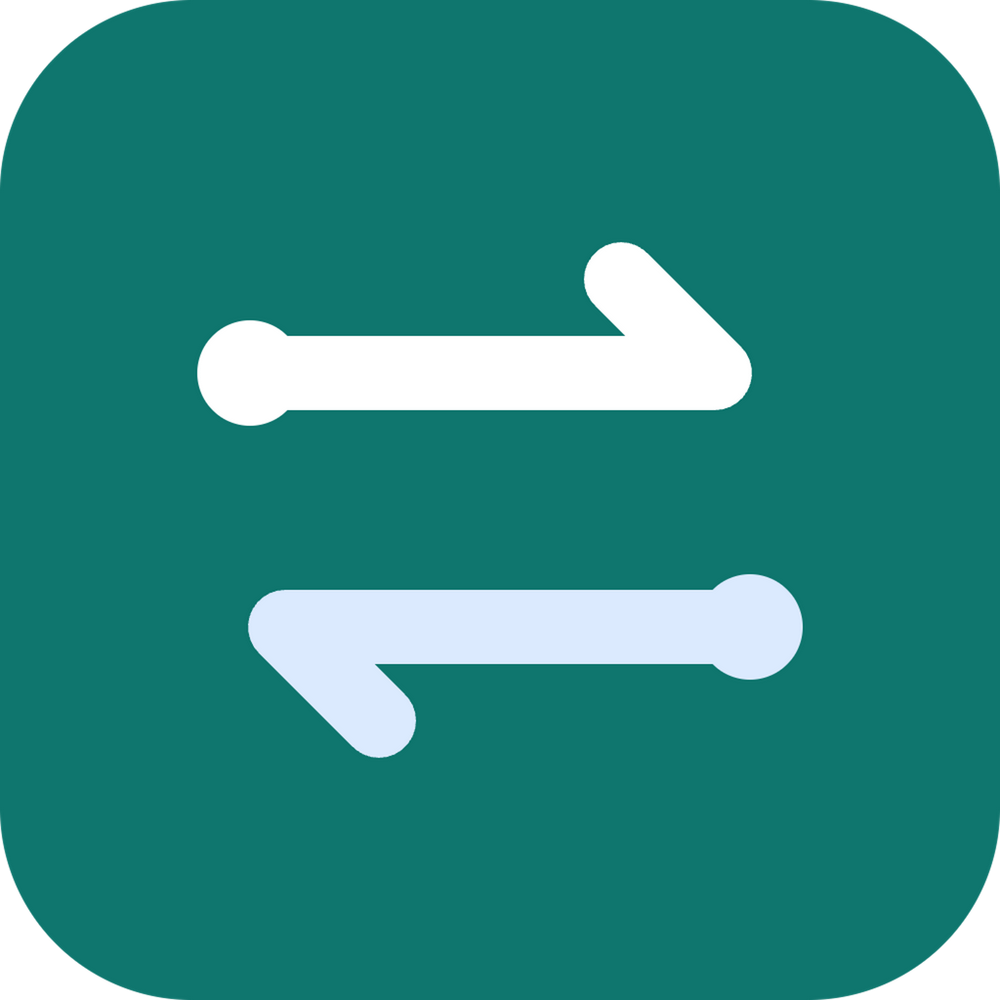

<div align="center">
  
  <h1>Codex Skills Sync</h1>
  <p><strong>Codex 技能同步器</strong></p>
  <p>让多台 Mac 和 Windows 自动拥有同一套 Codex Skills。</p>
  <p>由 <a href="#关于作者"><strong>Git源宝</strong></a> 开源维护</p>

  <p>
    <a href="https://github.com/gityuanbao/codex-skills-sync-app/releases/latest"></a>
    <a href="./LICENSE"></a>
    <a href="#下载与安装"></a>
  </p>
</div>

---

你在电脑 A 做好了一个 Codex Skill，换到电脑 B 却找不到；或者多台电脑上的同名 Skill 已经变成了不同版本。

Codex Skills Sync 是一个面向中文用户的免费开源桌面工具。它通过你的私人 GitHub 仓库保存技能版本，并在多台电脑之间自动同步。完成第一次设置后，不需要再手动上传或下载。

## 它能做什么

- 自动发现 `~/.agents/skills` 或 `~/.codex/skills` 中的 Codex Skills。
- 在 macOS 与 Windows 之间双向同步技能。
- 软件启动、技能发生变化和定时检查时自动同步。
- 打开 Codex 新任务时可以再检查一次最新版本。
- 使用 Git 保存历史版本，可以查看和恢复过去的修改。
- 两台电脑同时修改同一内容时暂停同步，不会悄悄覆盖文件。
- 自动识别系统代理及 ClashX 等工具常用的本机 HTTP 代理。
- 提供完整中文界面、四步首次设置和系统托盘后台运行。

它只同步包含 `SKILL.md` 的技能文件夹，不会同步 GPT/Codex 登录状态、API Key、token、聊天记录、缓存或整个 `~/.codex` 目录。

## 下载与安装

| 系统 | 支持版本 | 下载 |
| --- | --- | --- |
| macOS | Apple Silicon（M1/M2/M3/M4） | [下载 Mac 版](https://github.com/gityuanbao/codex-skills-sync-app/releases/download/v0.3.3/Codex-Skill-Sync-0.3.3-mac-arm64.zip) |
| Windows | Windows 10/11 x64 | [下载 Windows 版](https://github.com/gityuanbao/codex-skills-sync-app/releases/download/v0.3.3/Codex-Skill-Sync-0.3.3-win-x64.exe) |

[查看全部版本与更新说明](https://github.com/gityuanbao/codex-skills-sync-app/releases)

当前安装包尚未购买商业代码签名证书：macOS 可能提示“未知开发者”，Windows 可能提示“未知发布者”。请只从本仓库的 Releases 页面下载，并在系统安全提示中确认后继续。

当前版本要求电脑上有可用的 Git。软件会在第一次设置时自动检查；大多数安装了 Codex 开发环境的电脑已经具备 Git。

### v0.3.3 文件校验

```text
macOS   SHA-256  4add16d8fb04d42cac23483f70af9ec2c52c3b4d950f835a697c97e1e4740faa
Windows SHA-256  f8e03387bc0f9afc51c9f98b239e9962a7803c437a9410621a999a28b983c2cd
```

## 第一次使用

第一次打开只需要四步：

1. 确认软件自动发现的本机技能数量。
2. 点击“使用浏览器连接 GitHub”，在 GitHub 官方页面完成授权。
3. 选择这台电脑是“技能最完整的电脑”还是“从其他电脑获取技能”。
4. 点击“开始同步”。

软件会自动创建私人技能仓库、配置路径、完成第一次同步并开启后台同步。你不需要填写仓库地址，也不需要自己执行 Git 命令。

连接 GitHub 时，一次性授权码会自动带入 GitHub 官方设备页面，同时复制到剪贴板。如果页面没有自动填入，可以直接粘贴。

### 第一台电脑

在技能最完整的电脑上选择“这台电脑的技能最完整”。本机技能会成为 GitHub 中保存的第一份版本。

### 其他电脑

使用同一个 GitHub 账号连接，然后选择“我要从其他电脑获取技能”。软件会先下载 GitHub 上已有版本；遇到同名但内容不同的技能时会暂停并保留副本。

## 日常使用

配置完成后，通常不需要再打开主界面：

- 软件启动时检查一次。
- 技能文件变化约 2.5 秒后自动同步。
- 默认每 30 秒获取其他电脑的更新。
- 打开 Codex 新任务时可以再检查一次。
- 临时离线后会在后续检查中自动重试。
- 需要时可以从系统托盘点击“立即同步”。

## 账号与隐私

- 不需要登录 GPT，也不会调用 OpenAI API。
- 需要一个 GitHub 账号，用于保存你的私人技能仓库。
- 软件不会要求、读取或保存 GitHub 密码。
- 登录、验证码和授权确认都在 GitHub 官方页面完成。
- GitHub 授权由官方 GitHub CLI 处理，优先保存在 macOS 钥匙串或 Windows 凭据管理器中。
- 软件自动创建的技能仓库默认是私有仓库。
- 你的技能内容不会上传到本开源项目仓库。

GitHub 不再支持使用账号密码验证 Git 操作。本工具采用 GitHub 官方浏览器授权，不要求用户生成或粘贴 Personal Access Token。

## 两个仓库有什么区别

安装并使用软件后，你可能会在 GitHub 账号中看到两个名字相近的仓库：

| 仓库 | 可见性 | 用途 |
| --- | --- | --- |
| `codex-skills-sync-app` | 公开 | 本软件的开源代码、说明和安装包 |
| `codex-skill-sync` | 私有 | 软件为你自动创建的个人技能数据仓库 |

程序只会自动管理名字完全匹配的私人数据仓库 `codex-skill-sync`，不会把你的技能上传到公开源码仓库。

## 冲突保护

每次同步会依次完成：

1. 保存本机技能改动并创建 Git 版本。
2. 获取远程版本并尝试自动合并。
3. 合并成功后上传最新版本。
4. 将最终结果应用到 Codex 技能目录。

如果两台电脑修改了同一文件的同一位置，自动同步会暂停。用于比较的本机和远程副本会保存在：

```text
~/.codex-skill-sync/conflicts/
```

## 常见问题

### 每次都需要手动上传和下载吗？

不需要。完成第一次设置后，软件会在后台自动同步。

### 软件需要我的 GPT 账号吗？

不需要。软件只连接 GitHub，不读取 Codex 或 ChatGPT 登录状态。

### 卸载重装后为什么没有再次出现首次设置？

为了升级时不丢失设置，卸载应用不会删除 `~/.codex-skill-sync` 中的配置和版本数据。需要重新设置时，可以先退出软件，再备份并移走这个目录。

### GitHub 页面打不开或授权超时怎么办？

请先确认浏览器能够访问 GitHub。软件会自动尝试系统代理、环境变量代理，以及 ClashX 等工具常用的本机 HTTP 代理端口。

### 支持 Intel Mac 吗？

当前公开安装包只支持 Apple Silicon。Intel Mac 版本尚未构建和验证。

## 本地数据位置

```text
配置文件     ~/.codex-skill-sync/config.json
桌面设置     ~/.codex-skill-sync/desktop.json
同步仓库     ~/.codex-skill-sync/repo
冲突副本     ~/.codex-skill-sync/conflicts
技能目录     自动发现 ~/.agents/skills 或 ~/.codex/skills
```

## 开发与构建

需要 Node.js 18 或更高版本以及 Git：

```bash
npm install
npm test
npm run desktop
```

构建安装包：

```bash
npm run desktop:mac
npm run desktop:win
```

Windows 安装包可以在 Mac 上交叉构建，但正式发布前仍应在 Windows 真机验证安装、系统托盘和凭据管理器。

欢迎通过 Issues 报告问题，也欢迎提交 Pull Request 改进中文体验、平台兼容性和同步安全。

## 关于作者

本项目由 **Git源宝** 发起并维护，希望让中文 Codex 用户更轻松地管理和同步自己的 Skills。你可以通过以下平台关注项目更新、AI 工具实测和相关教程：

| 平台 | 账号 | 关注方式 |
| --- | --- | --- |
| B站 | Git源宝 | [访问 B站主页](https://space.bilibili.com/38061207) |
| 抖音 | Git源宝 | [访问抖音主页](https://www.douyin.com/user/MS4wLjABAAAArAKj7BGfaz8nbPk8NVIpOH6P6Uxqm7M1uM6SG2dFxRtoymhcsTTjFELLuen7CxPj) |
| 微信公众号 | Git源宝 | 微信内搜索公众号 `Git源宝` |

## 开源协议

本项目采用 [MIT License](./LICENSE)。你可以免费使用、复制、修改、分发和用于商业项目，但需要保留原始版权与协议声明。

仓库中附带的 GitHub CLI 二进制文件由 GitHub CLI 项目提供，并遵循其各自目录中的 MIT License。

本项目是社区开源工具，与 OpenAI、Codex 或 GitHub 没有官方隶属或背书关系。所有产品名称和商标归其各自权利人所有。
